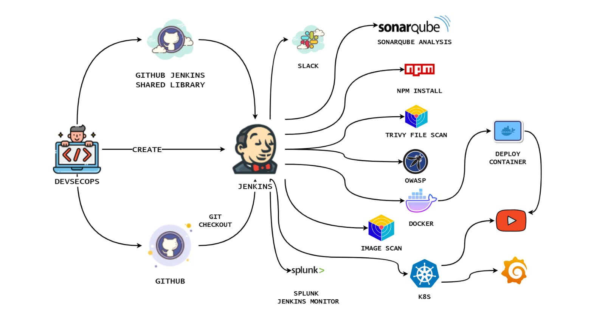
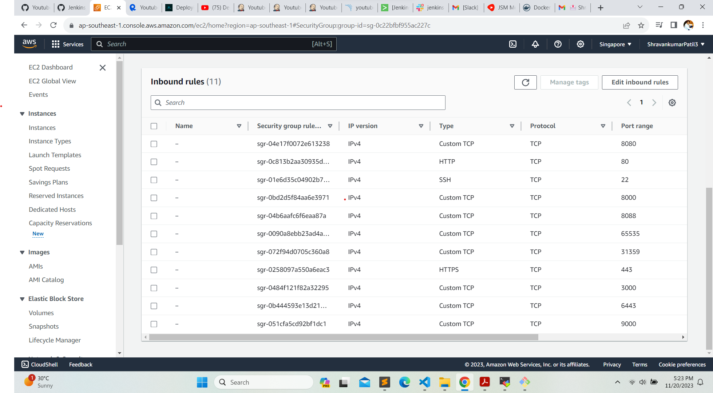
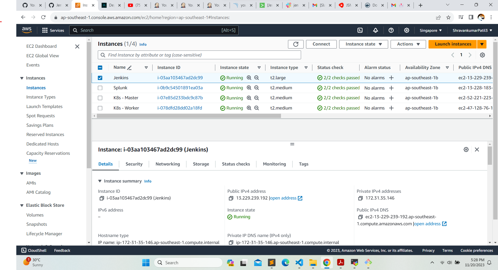

  <h1 align="center"><b>Deploying a YouTube Clone App with DevSecOps and  Jenkins Shared Library</b></h1>
  
  
<b>This blog is your gateway to a secure DevSecOps pipeline for your project. With Kubernetes, Docker, SonarQube, Trivy, OWASP Dependency Check, Prometheus, Grafana, Jenkins (and a shared library), Splunk, Rapid API, Slack notifications, and efficient parameters for creating and destroying your environment, we've got you covered.</b>

  <h4>
      <b>
        <u>
          <a href="https://github.com/Shravankumar1989/Youtube-clone-app.git">
            Click here for the GitHub repository.
          </a>
        </u>
      </b>
  </h4>
  <h4>
    Please follow the steps below.
  </h4>
  
<b>Step 1 - </b>Launch an Ubuntu 22.04 instance for Jenkins

  
<b>Step 2.1 - </b>Install Docker on the Jenkins machine

  
<b>Step 2.2 - </b>Install Trivy on Jenkins machine

  
<b>Step 3.1 - </b>Launch an Ubuntu instance for Splunk

  
<b>Step 3.2 - </b>Install the Splunk app for Jenkins

  
<b>Step 4.1 - </b>Integrate Slack for Notifications

  
<b>Step 4.2 - </b>Install the Jenkins CI app on Slack

  
<b>Step 5.1 - </b>Start Job

  
<b>Step 5.2 - </b>Create a Jenkins shared library in GitHub

  
<b>Step 5.3 - </b>Add Jenkins shared library to Jenkins system

  
<b>Step 5.4 - </b>Run Pipeline

  
<b>Step 6.1 - </b>Install Plugin

  
<b>Step 6.2 - </b>Configure Java and Nodejs in Global Tool Configuration

  
<b>Step 6.3 - </b>Configure Sonar Server in Manage Jenkins

  
<b>Step 6.4- </b>Add New stages to the pipeline

  
<b>Step 7 - </b>Install OWASP Dependency Check Plugins

  
<b>Step 8.1 - </b>Docker Image Build and Push

  
<b>Step 8.2 - </b>Create an API key from Rapid API

  
<b>Step 8.3 - </b>Run the Docker container

  
<b>Step 9.1 - </b>Kubernetes Setup

  
<b>Step 9.2 - </b>Kubectl is to be installed on Jenkins

  
<b>Step 9.3 - </b>Kubernetes Master-Slave setup

  
<b>Step 9.4 - </b>Install Helm & Monitoring K8S using Prometheus and Grafana

  
<b>Step 9.5 - </b>Kubernetes Deployment

  <h2><b>Step 1 - Launch an Ubuntu 22.04 instance for Jenkins</b></h2>
  
<b>Log into AWS Console: Sign in to your AWS account.</b>

  
<b>Launch an Instance:</b>

  
<b>Choose "EC2" from services. Click "Launch Instance."</b>

  
<b>Choose an AMI: Select an Ubuntu image.</b>

  
<b>Choose an Instance Type: Pick "t2.large."</b>

  
<b>Key Pair: Choose an existing key pair or create a new one.</b>

  
<b>Configure Security Group: Create a new security group. Add rules for HTTP, and HTTPS, and open all ports for learning purposes.</b>

  
  
<b>Add Storage: Allocate at least 20 GB of storage.</b>

  
<b>Launch Instance: Review and launch the instance.</b>

  
<b>Access Your Instance: Use SSH to connect to your instance with the private key.</b>

  
<b>Keep in mind, that opening all ports is not recommended for production environments; it's just for educational purposes.</b>

  
  
<b>Connect to Your EC2 Instance and Install Jenkins:</b>

  
<b>Use MobaXterm or PuTTY to connect to your EC2 instance. Create a shell script named</b>

  
  
<b></b>

  
<b></b>

  
<b></b>

  
<b></b>

  
<b></b>

  
<b></b>

  
<b></b>

  
<b></b>

  
<b></b>

  
<b></b>

  
<b></b>

  
<b></b>

  
<b></b>

  
<b></b>

  
<b></b>

  
<b></b>

  
<b></b>

  
<b></b>

  
<b></b>

  
<b></b>

  
<b></b>

  
<b></b>

  
  

