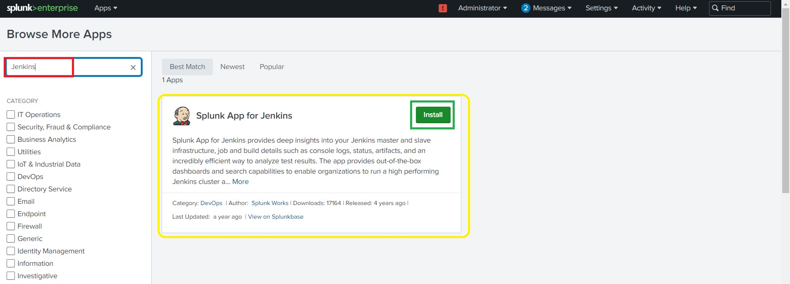
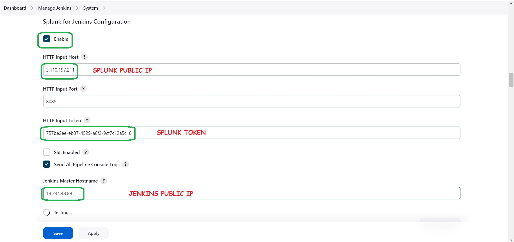
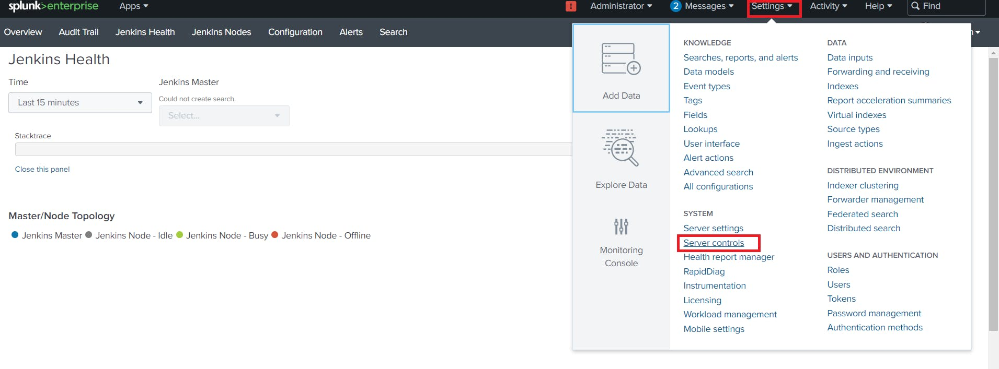
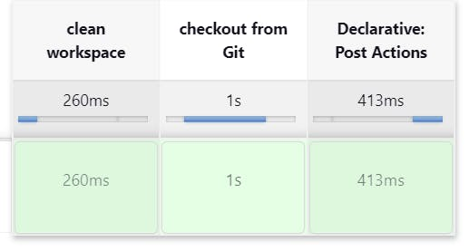

<div>
  <h1 align="center"><b>Deploying a YouTube Clone App with DevSecOps and <br/>Jenkins Shared Library</b></h1>
  
  <p><b>This blog is your gateway to a secure DevSecOps pipeline for your project. With Kubernetes, Docker, SonarQube, Trivy, OWASP Dependency Check, Prometheus, Grafana, Jenkins (and a shared library), Splunk, Rapid API, Slack notifications, and efficient parameters for creating and destroying your environment, we've got you covered.</b></p>
  <h4>
      <b>
        <u>
          <a href="https://github.com/Shravankumar1989/Youtube-clone-app.git">
            Click here for the GitHub repository.
          </a>
        </u>
      </b>
  </h4>
  <h4>
    Please follow the steps below.
  </h4>
  <p><b>Step 1 - </b>Launch an Ubuntu 22.04 instance for Jenkins</p>
  <p><b>Step 2.1 - </b>Install Docker on the Jenkins machine</p>
  <p><b>Step 2.2 - </b>Install Trivy on Jenkins machine</p>
  <p><b>Step 3.1 - </b>Launch an Ubuntu instance for Splunk</p>
  <p><b>Step 3.2 - </b>Install the Splunk app for Jenkins</p>
  <p><b>Add Splunk Plugin in Jenkins</b></p>
  <p><b>Restart Both Splunk and Jenkins</b></p>
  <p><b>Step 4.1 - </b>Integrate Slack for Notifications</p>
  <p><b>Step 4.2 - </b>Install the Jenkins CI app on Slack</p>
  <p><b>Install Slack Notification Plugin in Jenkins</b></p>
  <p><b>Step 5.1 - </b>Start Job</p>
  <p><b>Step 5.2 - </b>Create a Jenkins shared library in GitHub</p>
  <p><b>Step 5.3 - </b>Add Jenkins shared library to Jenkins system</p>
  <p><b>Step 5.4 - </b>Run Pipeline</p>
  <p><b>Step 6 - </b>Install Plugins like JDK, Sonarqube Scanner, NodeJs</p>
  <p><b>Step 6.1 - </b>Install Plugin</p>
  <p><b>Step 6.2 - </b>Configure Java and Nodejs in Global Tool Configuration</p>
  <p><b>Step 6.3 - </b>Configure Sonar Server in Manage Jenkins</p>
  <p><b>Step 6.4 - </b>Add New stages to the pipeline</p>
  <p><b>Step 7 - </b>Install OWASP Dependency Check Plugins</p>
  <p><b>Step 8.1 - </b>Docker Image Build and Push</p>
  <p><b>Step 8.2 - </b>Create an API key from Rapid API</p>
  <p><b>Step 8.3 - </b>Run the Docker container</p>
  <p><b>Step 9.1 - </b>Kubernetes Setup</p>
  <p><b>Step 9.2 - </b>Kubectl is to be installed on Jenkins</p>
  <p><b>Step 9.3 - </b>Kubernetes Master-Slave setup</p>
  <p><b>Step 9.4 - </b>Install Helm & Monitoring K8S using Prometheus and Grafana</p>
  <p><b>Step 9.5 - </b>Kubernetes Deployment</p>

  <h2><b>Step 1 - Launch an Ubuntu 22.04 instance for Jenkins</b></h2>
  <p><b>Log into AWS Console: Sign in to your AWS account.</b></p>
  <p><b>Launch an Instance:</b></p>
  <p><b>Choose "EC2" from services. Click "Launch Instance."</b></p>
  <p><b>Choose an AMI: Select an Ubuntu image.</b></p>
  <p><b>Choose an Instance Type: Pick "t2.large."</b></p>
  <p><b>Key Pair: Choose an existing key pair or create a new one.</b></p>
  <p><b>Configure Security Group: Create a new security group. Add rules for HTTP, and HTTPS, and open all ports for learning purposes.</b></p>
  
  <p><b>Add Storage: Allocate at least 20 GB of storage.</b></p>
  <p><b>Launch Instance: Review and launch the instance.</b></p>
  <p><b>Access Your Instance: Use SSH to connect to your instance with the private key.</b></p>
  <p><b>Keep in mind, that opening all ports is not recommended for production environments; it's just for educational purposes.</b></p>
  
  <p><b>Connect to Your EC2 Instance and Install Jenkins:</b></p>
  <p><b>Use MobaXterm or PuTTY to connect to your EC2 instance. Create a shell script named</b></p>
  
  ```sh
  # Open the file 'install_jenkins.sh' in the 'vi' editor with superuser privileges
  sudo vi install_jenkins.sh
  ```

  ```sh
  #!/bin/bash
  # Update the package lists for upgrades and new package installations
  sudo apt update -y
  
  # Install the OpenJDK version 11 JDK package
  sudo apt install openjdk-11-jdk -y
  
  # Download the Jenkins repository signing key and save it to '/usr/share/keyrings/jenkins-keyring.asc'
  sudo wget -O /usr/share/keyrings/jenkins-keyring.asc \
    https://pkg.jenkins.io/debian-stable/jenkins.io-2023.key
  
  # Add the Jenkins repository to the system's software sources list
  echo deb [signed-by=/usr/share/keyrings/jenkins-keyring.asc] \
    https://pkg.jenkins.io/debian-stable binary/ | sudo tee \
    /etc/apt/sources.list.d/jenkins.list > /dev/null
  
  # Update the package lists to include packages from the newly added Jenkins repository
  sudo apt-get update -y

  # Install Jenkins from the added repository
  sudo apt-get install jenkins -y
  
  # Start the Jenkins service
  sudo systemctl start jenkins
  
  # Check and display the status of the Jenkins service
  sudo systemctl status jenkins
  ```
  
  <p><b>Save and exit the text editor.</b></p>
  <p><b>Make the script executable:</b></p>
  
   ```sh
  # Grant execute permission to the 'install_jenkins.sh' script
  sudo chmod +x install_jenkins.sh
  ```
  <p><b>Run the script:</b></p>
  
  ```sh
  # Execute the 'install_jenkins.sh' script
  ./install_jenkins.sh
  ```
  <p><b>The script will install Jenkins and start the Jenkins service.</b></p>
  <p><b>You will need to go to your AWS EC2 Security Group and open Inbound Port 8080 since Jenkins works on Port 8080.</b></p>
  <p><b>Now, grab your Public IP Address</b></p>
  
  ```sh
  # This line seems to be an indication to check Jenkins on the provided EC2 public IP at port 8080
  # <EC2 Public IP Address:8080>
  # Display the initial admin password for Jenkins
  sudo cat /var/lib/jenkins/secrets/initialAdminPassword
  ```

  
  <p><b>Now, install the suggested plugins.</b></p>
  
  <p><b>Jenkins will now get installed and install all the libraries.</b></p>
  <p><b>Create an admin user</b></p>
  
  <p><b>Click on save and continue.</b></p>
  <p><b>Jenkins Dashboard</b></p>
  

  <h2><b>Step 2.1 - Install Docker on the Jenkins machine</b></h2>
  <p><b>Run the below commands to install the docker</b></p>
  
  ```sh
  # Update the package lists for upgrades and new package installations
  sudo apt-get update
  
  # Install Docker
  sudo apt-get install docker.io -y
  
  # Add the current user (assumed to be 'ubuntu') to the 'docker' group
  sudo usermod -aG docker $USER
  
  # Apply the new group membership without logging out and back in
  newgrp docker
  
  # Change the permissions of the Docker socket to allow all users to access it
  sudo chmod 777 /var/run/docker.sock
  ```

  <p><b>After the docker installation, we will create a Sonarqube container (Remember to add 9000 ports in the security group).</b></p>
  <p><b>Run this command on your EC2 instance to create a SonarQube container:</b></p>

  ```sh
  # Run SonarQube in a Docker container, mapping port 9000 on the host to port 9000 in the container
  docker run -d --name sonar -p 9000:9000 sonarqube:lts-community
  ```
  <p><b>Now copy the IP address of the ec2 instance</b></p>

  ```sh
  # This line seems to be an instruction to access SonarQube on the provided EC2 public IP at port 9000
  # <ec2-public-ip:9000>
  ```

  
  <p><b>Enter username and password, click on login and change password</b></p>

  ```sh
  # These lines indicate the default SonarQube credentials, which are typically changed during initial setup
  # username admin
  # password admin
  ```
  
  <p><b>Update New password, This is Sonar Dashboard.</b></p>
  

  <h2><b>Step 2.2 - Install Trivy on Jenkins machine</b></h2>
  <p><b>Create a shell script</b></p>
  
   ```sh
  # Open the file 'trivy.sh' in the 'vi' editor with superuser privileges
  sudo vi trivy.sh
  ```

  <p><b>Paste the below commands</b></p>

   ```sh
  # Install wget, apt-transport-https, gnupg, and lsb-release packages
  sudo apt-get install wget apt-transport-https gnupg lsb-release -y
  
  # Add the GPG key for the Trivy repository
  wget -qO - https://aquasecurity.github.io/trivy-repo/deb/public.key | gpg --dearmor | sudo tee /usr/share/keyrings/trivy.gpg > /dev/null
  
  # Add the Trivy repository to the system's software sources list
  echo "deb [signed-by=/usr/share/keyrings/trivy.gpg] https://aquasecurity.github.io/trivy-repo/deb $(lsb_release -sc) main" | sudo tee -a /etc/apt/sources.list.d/trivy.list
  
  # Update the package lists to include packages from the newly added Trivy repository
  sudo apt-get update
  
  # Install Trivy
  sudo apt-get install trivy -y
  ```

  <p><b>Provide executable permissions and run the shell script</b></p>

   ```sh
  # Grant execute permission to the 'trivy.sh' script
  sudo chmod +x trivy.sh
  
  # Execute the 'trivy.sh' script
  ./trivy.sh
  ```

  <p><b>This will install Trivy on our Jenkins machine.</b></p>

  <h2><b>Step 3.1 - Launch an Ubuntu instance for Splunk</b></h2>
  <p><b>Step 1: Launch Instances</b></p>
  <ol>
    <li>Log in to your AWS console or your chosen cloud provider.</li>
    <li>Navigate to the EC2 service and launch Ubuntu 22.04 instances. Ensure you select T2.medium as the instance type and allocate 24GB of storage to each instance.</li>
  </ol>
  <p><b>Step 2: Install Splunk</b></p>
  <ol>
    <li>At this point, the first machine is set up with Jenkins. You can now move to the second machine and proceed with the installation of Splunk.</li>
    <li>Connect to your second instance using Putty or Mobaxtreme. To download and install Splunk on your Ubuntu instance use the wget command, use the following command:</li>
  </ol>
  
  ```sh
  # Download the Splunk package
  wget -O splunk-9.1.1-64e843ea36b1-linux-2.6-amd64.deb "https://download.splunk.com/products/splunk/releases/9.1.1/linux/splunk-9.1.1-64e843ea36b1-linux-2.6-amd64.deb"
  ```
  <p><b>To Depackage the Splunk use the below command</b></p>

  ```sh
  # Install the downloaded Splunk package
  sudo dpkg -i splunk-9.1.1-64e843ea36b1-linux-2.6-amd64.deb
  ```

  ```sh
  # Enable Splunk to start at boot
  sudo /opt/splunk/bin/splunk enable boot-start
  ```

  <p><b>By running this command, you ensure that Splunk Enterprise is configured to start automatically when your Ubuntu system boots, allowing you to seamlessly integrate it into your workflow.</b></p>
  <p><b>Please note that after running this command, you should follow the on-screen prompts to accept the terms and complete the setup to 100%.</b></p>
  <p><b>After completing the initial setup and accepting the terms, you'll be prompted to create an admin user.</b></p>
  <p><b>Administrator Username: Choose a username for the admin account. This should be a unique and secure username.</b></p>
  <p><b>Administrator Password: Set a strong and secure password for the admin account. It's important to choose a password that combines upper and lower-case letters, numbers, and special characters for enhanced security.</b></p>
  <p><b>Confirm your password to ensure it matches the one you initially entered.</b></p>
  <p><b>By creating an administrator username and password, you'll have full access to your Splunk instance, allowing you to configure and manage it effectively.</b></p>
  <p><b>The command sudo ufw allow OpenSSH is used to allow incoming SSH traffic through the UFW (Uncomplicated Firewall) on your Ubuntu system. It's essential for enabling SSH access to your server.</b></p>

  ```sh
  # Allow OpenSSH through the firewall
  sudo ufw allow openSSH
  ```
  <p><b>By running this command, you ensure that SSH access is permitted through your firewall, which is crucial for remote server management and administration.</b></p>
  <p><b>The command sudo ufw allow 8000 is used to allow incoming network traffic on port 8000 through the UFW (Uncomplicated Firewall) on your Ubuntu system. 
    It permits access to a specific port for network services or applications.</b></p>

  ```sh
  # Allow traffic on port 8000 through the firewall (commonly used by Splunk Web)
  sudo ufw allow 8000
  ```

  <p><b>sudo ufw status: This command allows you to check the status of your UFW firewall. It will display information about whether the firewall is active, 
    which rules are enabled, and whether it's set to allow or deny specific types of traffic.</b></p>
  <p><b>sudo ufw enable: This command is used to enable the UFW firewall if it's not already active. Enabling the firewall ensures that the rules you've configured or will configure are enforced.</b></p>
  <p><b>By running these commands, you can both check the current status of your firewall and activate it to apply the defined rules and settings.</b></p>

  ```sh
  # Display the current status of the firewall
  sudo ufw status
  
  # Enable the firewall
  sudo ufw enable
  ```
  <p><b>The command sudo /opt/splunk/bin/splunk start is used to start the Splunk Enterprise application on your system. When you run this command with superuser privileges (using sudo), it initiates the Splunk service, allowing you to begin using the Splunk platform for data analysis, monitoring, and other data-related tasks.</b></p>

  ```sh
  # Start the Splunk service
  sudo /opt/splunk/bin/splunk start
  ```

  <p><b>After successfully starting your Splunk instance, you can now access its web interface to start exploring and analyzing your data.</b></p>
  <p><b>Copy Your Splunk Instance Public IP Address: Navigate to your cloud provider's console and find the public IP address of your Splunk instance.</b></p>
  <p><b>Log in with Your Credentials: You'll be prompted to log in with the administrator username and password you created during the setup process (typically using the command sudo /opt/splunk/bin/splunk enable boot-start).</b></p>
  
   ```sh
  # This line seems to be an instruction to access Splunk on the provided public IP at port 8000
  # <splunk-public-ip:8000>
  ```
  
  <p><b>This is the Splunk Dashboard</b></p>
  

  <h2><b>Step 3.2 - Install the Splunk app for Jenkins</b></h2>
  <p><b>In Splunk Dashboard</b></p>
  <p><b>Click on Apps --> Find more apps</b></p>
  
  <p><b>Search for Jenkins in the Search bar</b></p>
  <p><b>You will get the Splunk app for Jenkins and click on install</b></p>
  
  <p><b>You will be prompted to provide your Splunk credentials. That's why we created a Splunk account</b></p>
  
  <p><b>Click on Agree and install</b></p>
  <p><b>Now click on Go home</b></p>
  
  <p><b>On the homepage of Splunk, you will see Jenkins has been added</b></p>
  
  <p><b>In the Splunk web interface, go to Settings > Data Inputs</b></p>
  
  <p><b>Click on HTTP Event Collector.</b></p>
  
  <p><b>Click on Global Settings</b></p>
  
  <p><b>Set All tokens to enabled</b></p>
  <p><b>Uncheck SSL enable</b></p>
  <p><b>Use 8088 port and click on save</b></p>
  
  <p><b>Now click on New token</b></p>
  
  <p><b>Provide a Name and click on the next</b></p>
  
  <p><b>Click Review</b></p>
  
  <p><b>Click Submit</b></p>
  
  <p><b>Click Start searching</b></p>
  
  <p><b>Now let's copy our token again</b></p>
  <p><b>In the Splunk web interface, go to Settings -> Data Inputs.</b></p>
  
  <p><b>Click on the HTTP event collector</b></p>
  
  <p><b>Now copy your token and keep it safe</b></p>
  
  <h2><b>Add Splunk Plugin in Jenkins</b></h2>
  <p><b>Go to Jenkins dashboard</b></p>
  <p><b>Click on Manage Jenkins --> Plugins --> Available plugins</b></p>
  <p><b>Search for Splunk and install it.</b></p>
  
  <p><b>Again Click on Manage Jenkins --> System</b></p>
  <p><b>Search for Splunk</b></p>
  <p><b>HTTP input host as SPLUNK PUBLIC IP</b></p>
  <p><b>HTTP token that you generated in Splunk</b></p>
  <p><b>Jenkins IP and apply.</b></p>
  
  <p><b>Now go to Putty or Mobaxtreme and In Splunk machine run this command</b></p>

  ```sh
  # Allow traffic on port 8088 through the Ubuntu Firewall (UFW)
  sudo ufw allow 8088
  ```
  <p><b>Now in the Jenkins dashboard Under Splunk click on Test connection</b></p>
  
  <h2><b>Restart Both Splunk and Jenkins</b></h2>
  <p><b>Let's Restart our Splunk machine</b></p>
  <p><b>Click on Settings --> Server controls</b></p>
  
  <p><b>Restart and log in again</b></p>
  
  <p><b>Now restart Jenkins and log in again.</b></p>

  ```sh
  <jenkins-ip:8080/restart> #this will restart jenkins
  ```
  <p><b>Now go to Splunk and click on the Jenkins app and you will get this output monitoring</b></p>
  <p><b>Sample image.</b></p>
  
  
  <h2><b>Step 4.1 - Integrate Slack for Notifications</b></h2>
  <p><b>Create a Slack account and create a channel Named Jenkins</b></p>
  
  <h2><b>Step 4.2 - Install the Jenkins CI app on Slack</b></h2>
  <p><b>Go to Slack and click on your name</b></p>
  <p><b>Select Settings and Administration</b></p>
  <p><b>Click on Manage apps</b></p>
  
  <p><b>It will open a new tab</b></p>
  <p><b>Search for Jenkins CI and click on it</b></p>
  
  <p><b>It will open another tab</b></p>
  <p><b>Click on Add to Slack</b></p>
  
  <p><b>Now choose your Slack channel</b></p>
  <p><b>Click on Add Jenkins CI integration.</b></p>
  
  <p><b>You will be redirected to this page</b></p>
  
  <p><b>Copy the team subdomain and integration token credential ID for later use.</b></p>
  
  
  <h2><b>Install Slack Notification Plugin in Jenkins</b></h2>
  <p><b>Go to Jenkins Dashboard</b></p>
  <p><b>Click on manage Jenkins --> Plugins --> Available plugins</b></p>
  <p><b>Search for Slack Notification and install</b></p>
  
  <p><b>Click on Manage Jenkins --> Credentials --> Global</b></p>
  <p><b>Select kind as Secret Text</b></p>
  <p><b>At Secret Section Provide Your Slack integration token credential ID</b></p>
  <p><b>Id and description are optional and create</b></p>
  
  
  <p><b>Click on Manage Jenkins --> System</b></p>
  <p><b>Go to the end of the page</b></p>
  <p><b>Workspace --> team subdomain</b></p>
  <p><b>Credential --> Select your Credential for Slack</b></p>
  <p><b>Default channel --> Provide your Channel name</b></p>
  <p><b>Test connection</b></p>
  
  
  <p><b>Click on Apply and save</b></p>
  <p><b>Add this to the pipeline</b></p>
  
  ```sh
  // Define a map for associating build statuses with Slack message colors
  def COLOR_MAP = [
      'FAILURE' : 'danger',
      'SUCCESS' : 'good'
  ]
  
  // Post-build actions
  post {
      // Execute the following block after every build, regardless of the build result
      always {
          // Print a message in the Jenkins console log
          echo 'Slack Notifications'
  
          // Send a notification to a Slack channel
          slackSend (
              // Specify the channel to send the message to, replace '#channel name' with your actual channel name
              channel: '#channel name',  
  
              // Set the color of the Slack message based on the build result using the COLOR_MAP
              color: COLOR_MAP[currentBuild.currentResult],
  
              // Compose the message with build details and a link to the build
              message: "*${currentBuild.currentResult}:* Job ${env.JOB_NAME} \n build ${env.BUILD_NUMBER} \n More info at: ${env.BUILD_URL}"
          )
      }
  }

  ```
  <p><b>You will get a Notification in Slack</b></p>

  <h2><b>Step 5.1 - Start Job</b></h2>
  <p><b>Go to Jenkins dashboard and click on New Item.</b></p>
  <p><b>Provide a name for the Job & click on Pipeline and click on OK.</b></p>
  <h2><b>Step 5.2 - Create a Jenkins shared library in GitHub</b></h2>
  <p><b>Create a new repository in GitHub named Jenkins_shared_library.</b></p>
  
  <p><b>Connect to your VS Code</b></p>
  <p><b>Create a directory named Jenkins_shared_library</b></p>
  <p><b>Create a Vars directory inside it</b></p>
  
  <p><b>Open Terminal</b></p>
  <p><b>Run the below commands to push to GitHub</b></p>

   ```sh
   # Create a README.md file and add the initial content
   echo "# Jenkins_shared_library" >> README.md
  
   # Initialize a new Git repository in the current directory
   git init
  
   # Add the README.md file to the staging area
   git add README.md
  
   # Commit the added file with a message
   git commit -m "first commit"
  
   # Rename the default branch to 'main'
   git branch -M main
  
   # Add a remote repository URL for pushing changes. Replace with your actual repository URL
   # make sure to change your repo Url here
   git remote add origin https://github.com/Aj7Ay/Jenkins_shared_library.git
  
   # Push the changes in the 'main' branch to the remote repository and set it to track the remote 'main' branch
   git push -u origin main

   ```

  <p><b>Now, Let's Write a Groovy script for our Pipeline</b></p>
  <p><b>Create a cleanWorkspace.groovy file and add the below code</b></p>

  ```sh
  // Filename: cleanWorkspace.groovy
  // Defines a function to clean the workspace
  
  // Default 'call' method without parameters, cleans the workspace
  def call() {
      cleanWs() // Invokes the cleanWs step to clean up the workspace
  }
  ```
  <p><b>Create checkoutGit.groovy file and add the below code</b></p>

  ```sh
  // Overloaded 'call' method with parameters for Git operations
  def call(String gitUrl, String gitBranch) {
      // Checks out a specific branch from a Git repository
      checkout([
          $class: 'GitSCM', // Specifies the SCM as Git
          branches: [[name: gitBranch]], // Sets the branch to checkout
          userRemoteConfigs: [[url: gitUrl]] // Sets the Git repository URL
      ])
  }
  ```

  <p><b>Now push them to GitHub using the below commands from vs code</b></p>

  ```sh
  # Adds all new or modified files to the staging area
  git add .

  # Commits the staged changes with a message
  git commit -m "message"

  # Pushes the commit to the 'main' branch of the remote repository
  git push origin main
  ```
  <h2><b>Step 5.3 - Add Jenkins shared library to Jenkins system</b></h2>
  <p><b>Go to Jenkins Dashboard</b></p>
  <p><b>Click on Manage Jenkins --> system</b></p>
  <p><b>Search for Global Pipeline Libraries and click on Add</b></p>
  
  <p><b>Now Provide a name that we have to call in our pipeline</b></p>
  
  
  <p><b>Click apply and save</b></p>
  <h2><b>Step 5.4 - Run Pipeline</b></h2>
  <p><b>Go to Jenkins Dashboard again & select the job and add the below pipeline</b></p>
  
  ```sh
  // Import the Jenkins shared library with the specified name
  @Library('Jenkins_shared_library') _
  
  // Define a map for associating build statuses with Slack message colors
  def COLOR_MAP = [
        'FAILURE' : 'danger',
        'SUCCESS' : 'good'
  ]
  
  // Define the pipeline
  pipeline{
      // Use any available agent
      agent any
  
      // Define parameters for the pipeline
      parameters {
          // Add a choice parameter named 'action' with options 'create' and 'delete'
          choice(name: 'action', choices: 'create\ndelete', description: 'Select create or destroy.')
      }
  
      // Define the stages of the pipeline
      stages{
          // First stage: Clean the workspace
          stage('clean workspace'){
              steps{
                  // Call the 'cleanWorkspace' method from the shared library
                  cleanWorkspace()
              }
          }
  
          // Second stage: Checkout code from a Git repository
          stage('checkout from Git'){
              steps{
                  // Call the 'checkoutGit' method from the shared library with repository URL and branch name
                  checkoutGit('https://github.com/Aj7Ay/Youtube-clone-app.git', 'main')
              }
          }
      }
  
      // Define post-build actions
      post {
          // Execute the following block after every build, regardless of the build result
          always {
              // Print a message in the Jenkins console log
              echo 'Slack Notifications'
  
              // Send a notification to a Slack channel
              slackSend (
                  // Specify the channel to send the message to, replace '#channel name' with your actual channel name
                  channel: '#channel name', 
  
                  // Set the color of the Slack message based on the build result using the COLOR_MAP
                  color: COLOR_MAP[currentBuild.currentResult],
  
                  // Compose the message with build details and a link to the build
                  message: "*${currentBuild.currentResult}:* Job ${env.JOB_NAME} \n build ${env.BUILD_NUMBER} \n More info at: ${env.BUILD_URL}"
              )
          }
      }
  }

  ```
  <p><b>Build with parameters and build</b></p>
  <p><b>Stage view</b></p>
  
  <h2><b>Step 6 - Install Plugins like JDK, Sonarqube Scanner, NodeJs</b></h2>
  <h2><b>Step 6.1 - Install Plugin</b></h2>
  <p><b>Goto Manage Jenkins →Plugins → Available Plugins →</b></p>
  <p><b>Install below plugins</b></p>
  <p><b>1 → Eclipse Temurin Installer (Install without restart)</b></p>
  <p><b>2 → SonarQube Scanner (Install without restart)</b></p>
  <p><b>3 → NodeJs Plugin (Install Without restart)</b></p>
  
  
  <h2><b>Step 6.2 - Configure Java and Nodejs in Global Tool Configuration</b></h2>
  <p><b>Goto Manage Jenkins → Tools → Install JDK(17) and NodeJs(16)→ Click on Apply and Save</b></p>
  
  
  <p><b></b></p>
  <p><b></b></p>
  <p><b></b></p>
  <p><b></b></p>
  <p><b></b></p>
  <p><b></b></p>
  <p><b></b></p>
  <p><b></b></p>
  <p><b></b></p>
  <p><b></b></p>
  <p><b></b></p>
  <p><b></b></p>
  <p><b></b></p>
  <p><b></b></p>
  <p><b></b></p>
</div>
